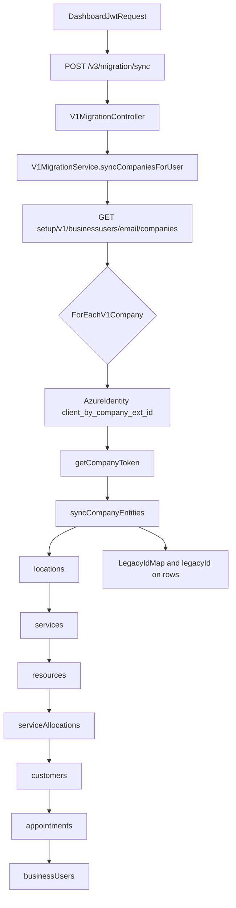

# OnSched — V1 migration sync workflow

## When to load this skill

- Editing [`api/services/v1MigrationService.js`](/home/unbalanced/Development/OnSched/v3/api/services/v1MigrationService.js), [`api/services/v1Migration/http.js`](/home/unbalanced/Development/OnSched/v3/api/services/v1Migration/http.js), [`api/routes/migration.js`](/home/unbalanced/Development/OnSched/v3/api/routes/migration.js), [`api/controllers/v1shim/migration.js`](/home/unbalanced/Development/OnSched/v3/api/controllers/v1shim/migration.js).
- Debugging missing entities after **`POST /v3/migration/sync`**, Azure identity / token failures, or incomplete appointment imports.
- Changing field mappings from v1 JSON → v3 models.

## Read first

1. [`rdme/docs/GetStarted/migratingFromV1.md`](/home/unbalanced/Development/OnSched/v3/rdme/docs/GetStarted/migratingFromV1.md)
2. [`api/docs/ARCHITECTURE.md`](/home/unbalanced/Development/OnSched/v3/api/docs/ARCHITECTURE.md)
3. https://docs.onsched.com/v1.0

## Pipeline overview

## V1 ↔ V3 mapping reference

- **Order:** locations → services → resources → allocations → customers → appointments → business users (`syncCompanyEntities` in `v1MigrationService.js`).
- **Services/resources:** align v1 schedule vs allocation indicators with v3 (see [`api/services/v1AllocationUtils.js`](/home/unbalanced/Development/OnSched/v3/api/services/v1AllocationUtils.js) and shim docs).
- **Allocations:** map limits and legacy IDs consistently; after writes that affect availability, **invalidate Redis availability cache** (see core hard rules).
- **Appointments:** UTC times; map statuses where both sides agree; see fidelity section below.
- **Unsupported v1-only concepts:** do not expand v3 schema just to mimic them — document and defer to native `/v3/*` adoption.

## Data fidelity policy

- Target **near-complete** transfer for paying migration customers; **appointments** first-class.
- Prefer **structured errors** (`progress.errors`) over silent skips when a row cannot be imported.
- When a v1 field has no v3 column, only merge into **notes** or **custom fields** if product-safe and documented.

## Known fidelity gaps inventory (documented — re-verify line numbers)

In [`api/services/v1MigrationService.js`](/home/unbalanced/Development/OnSched/v3/api/services/v1MigrationService.js):

| Gap | Where (approx.) |
| --- | --- |
| Bulk fetch only **`status=BK`** appointments | `syncAppointments` URL ~L1192 |
| **`Appointment.create`** omits many v1 fields (e.g. bookedBy, custom fields blob, calendar linkage, remindAt, audit/IP fields) | ~L1311–L1320 |
| **`createV3Appointment` returns `null`** without `progress.errors` when service missing | ~L1257–L1260 |
| Same when **no resources** resolve | ~L1285–L1289 |
| Same when **start/end** missing | ~L1305–L1308 |

**Resource blocks:** v1 `GET /setup/v1/resources/:id/blocks` are imported as v3 **`RecurringBlocks`** in **`syncV1ResourceBlocksForCompany`** (after `syncResources`). Rows use **`legacyId`** when v1 returns a stable block id.

Improving these is a **behavior change** → Changeset + docs handoff when customer-visible.

## Idempotence and cache

- Upsert keyed by **`legacyId`** and **`LegacyIdMap`** before inserting duplicates.
- After allocation or appointment writes that affect slots, clear **Redis availability cache** per project conventions.

## Identity and network dependencies

- [`api/services/v1IdentityService.js`](/home/unbalanced/Development/OnSched/v3/api/services/v1IdentityService.js) — Azure identity URLs, API keys, `V1_API_BASE` / staging.
- Corporate **IP allowlisting** blocking identity endpoints can prevent sync — see [`migratingFromV1.md`](/home/unbalanced/Development/OnSched/v3/rdme/docs/GetStarted/migratingFromV1.md).

## Logging and secrets

- Use `LOG_V1_MIGRATION` / `logV1MigrationDebug` in [`api/utils/logging/verboseLog.js`](/home/unbalanced/Development/OnSched/v3/api/utils/logging/verboseLog.js).
- Never log bearer tokens, client secrets, or full v1 payloads.

## Handoff before finishing

- Fidelity or sync semantics changed → **onsched-versioning**, **onsched-rdme-docs** if integrators need updates.
- Multi-layer → skill **onsched-agent-handoff**.
